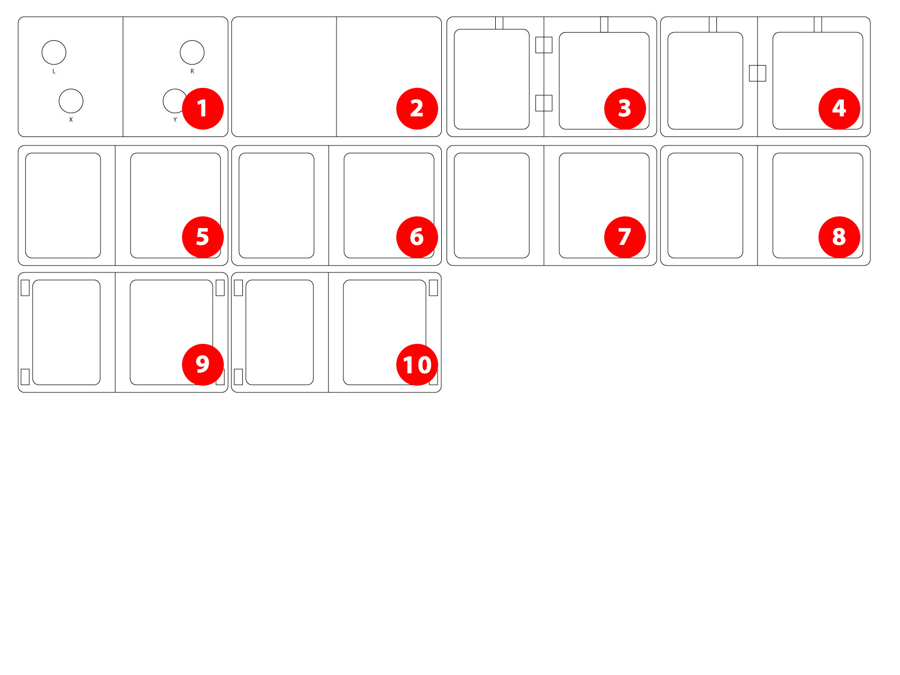
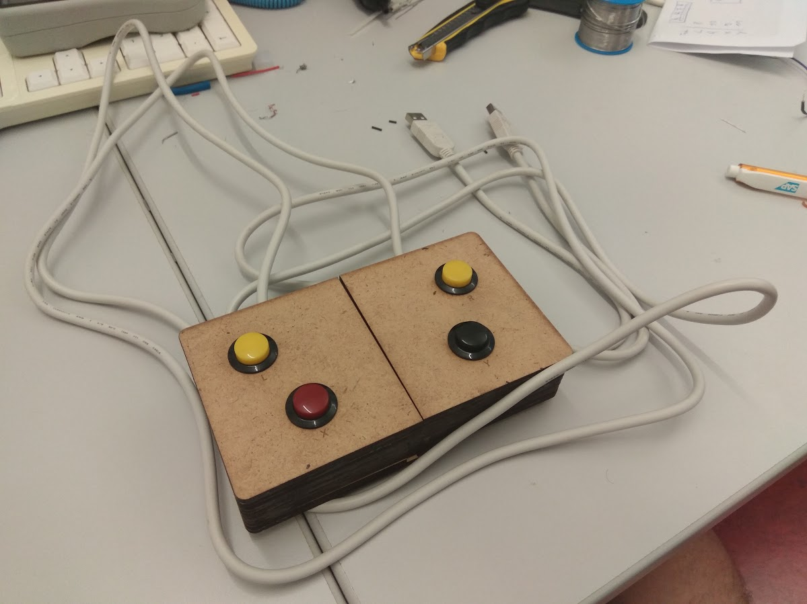
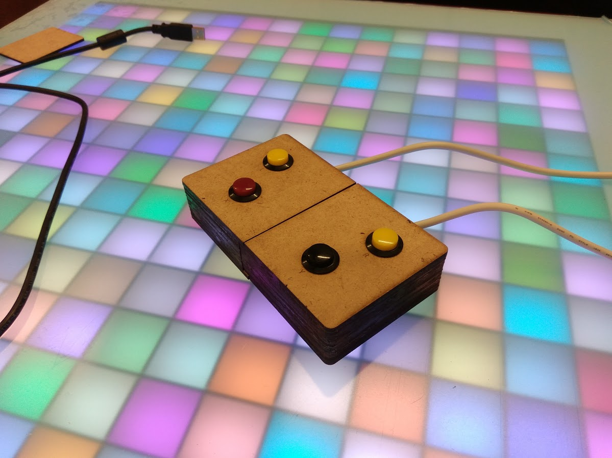

## Controller
### 1. Lasercutter Zuschnitt anlegen (1 Platte a 60x45cm)
[Illustratordatei](https://github.com/cbm-instructions/bits-please/blob/master/Controller/Zuschnitt_Controller.zip)

### 2. Den Zuschnitt mit einem Lasercutter zuschneiden und Einzelteile ausbrechen

### 3. Die verschiedenen Schichten verleimen.
Der Boden: Teil 2 muss mit Teil 10 verleimt werden.
Der Oberteil muss (in Reihenfolge) verleimt werden aus den Teilen:
- Teil 1
- Teil 5
- Teil 6
- Teil 7
- Teil 3
- Teil 4
- Teil 8 
- Teil 9

Nach dem Verleimen mit Büchern beschweren oder mit Schraubzwingen zusammendrücken.

### 4. Die Aussparungen mit Magneten bestücken
- 6 Stück sind dafür gedacht, den Controller zusammen zu halten
- 8 Stück um die beiden Böden zusammen zu halten
- Unbedingt die Richtung der Polarisation beachten (Magnetenpaare vorher aneinander legen)

(Im Bild nur 4 an den Seiten zu sehen, da dies erst später geändert wurde)

### 5. Buttons einsetzen

### 6. Buttons löten

### 7. Kabel mit zwei Kabelbindern und Heißkleber sichern.

### 8. Alles zusammensetzen

### 9. Anschließen - fertig!

