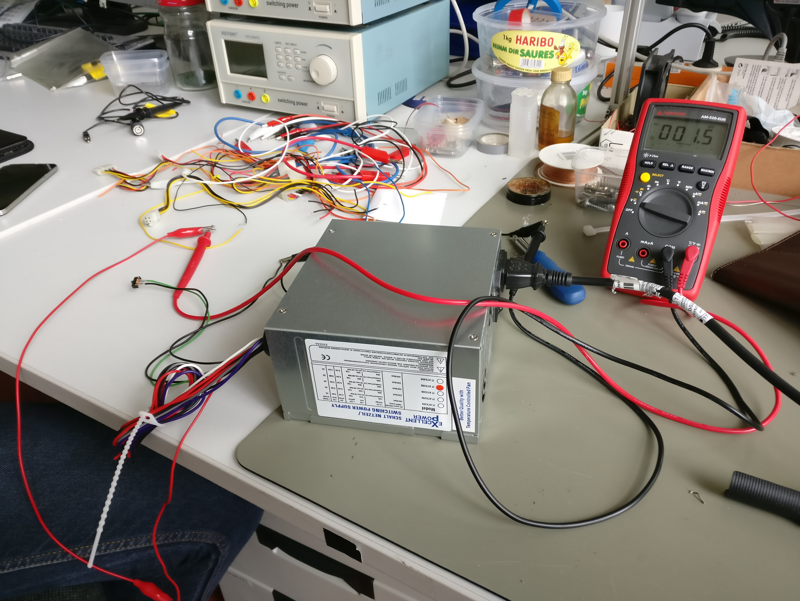
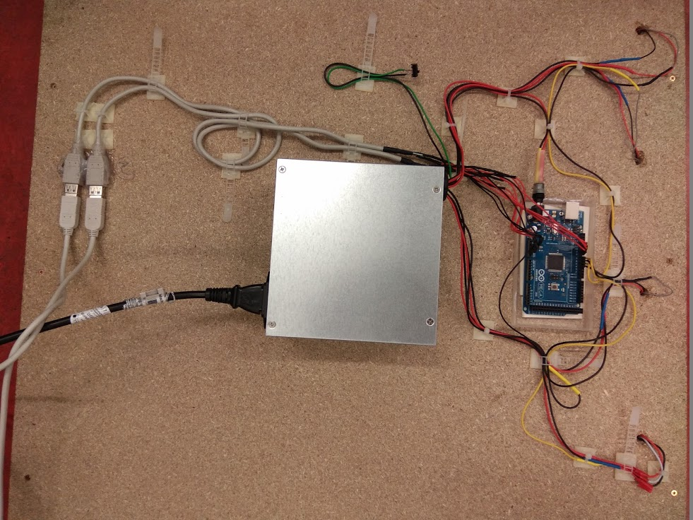

Zum öffnen und bearbeiten des Schaltplans wird das Tool "Fritzing" benötigt. 
http://fritzing.org/download/ 
# Elektronik

## Schaltplan
 

Der Schaltplan ist hier zu finden: [Fritzing-File](https://github.com/cbm-instructions/bits-please/blob/master/Schaltplan/Schaltplan.fzz), [Bild](https://github.com/cbm-instructions/bits-please/blob/master/Schaltplan/Schaltplan.png)

## Ansteuerung der LED Stripes
Um alle 16 LED-Stripes ansteuern zu können müssen diese zu vier Viererblöcken mit je 4x32 LED'S verlötet werden. Diese viererblöcke werden jeweils über einen Arduino Ausgang, eine 5V Spannungsversorgung und ein Masserkabel verkabelt.(Siehe Schaltplan)

 

## Stromversorgung 

### AdaFruit NeoPixel am Arduino Mega
Auf die Stromversorgung der einzelnen Pixel muss geachtet werden.  
Ein einzelner NeoPixel kann **20mA bis zu 60mA** Strom ziehen, je nach der Einstellung in der Software.

Da wir bei einer 16x16 Pixel Matrix, wobei jeder einzelner Pixel zwei LED NeoPixel besitzt, wird der Strombedarf wie folgt berechnet: 

**16 LED Stripes mit jeweils 32 Neopixel, was uns insgesamt auf 512 NeoPixel bringt.** 
**Das heißt der Strombedarf liegt bei: 10240mA - 30720mA ~ 10,24A - 30,72A**

### Netzteil
 

Bei der Verwendung eines ATX Computer Netzteils, werden die nicht verwendeten Kabel entfernt. Benötigt werden nur die roten (5V) Kabel und die schwarzen (Masse)kabel. Das Grüne Kabel (PS_ON) muss mit einem schwarzen Massekabel kurzgeschlossen werden. 

 

Die 

 

