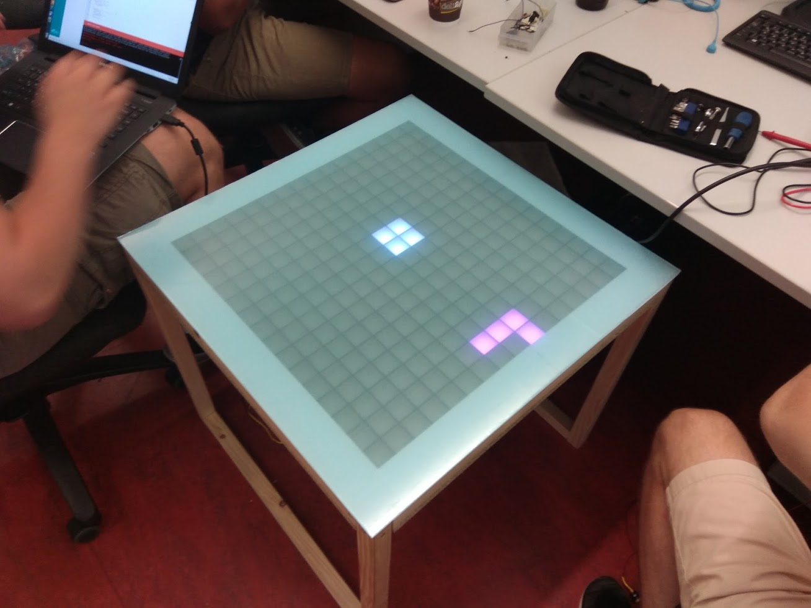
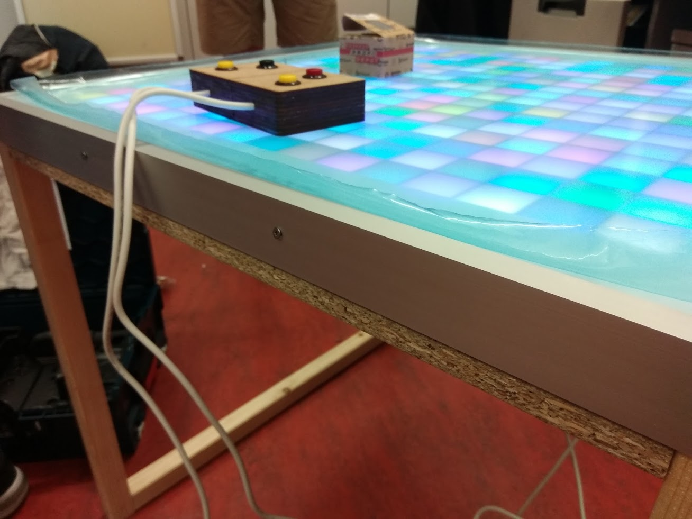
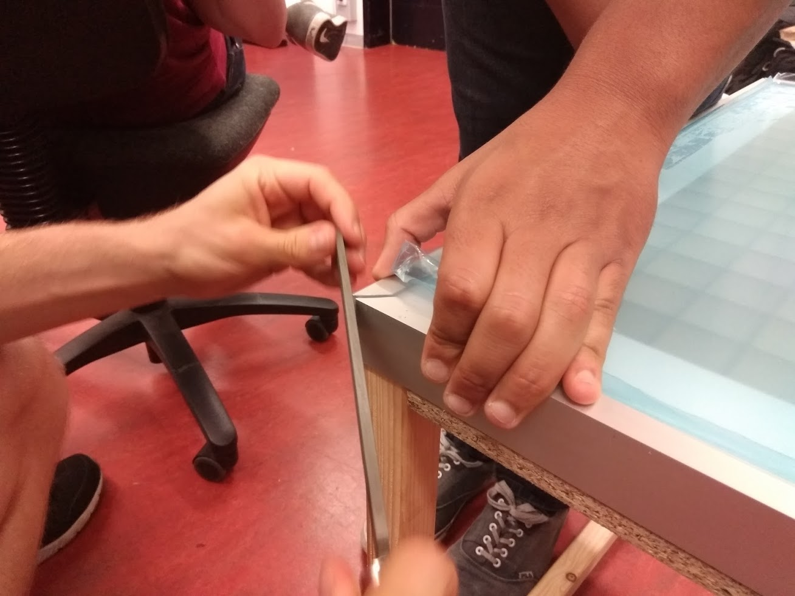

## Finish

### 1. L Leisten zuschneiden

### 2. Löcher bohren

### 3. Löcher senken

### 4. Plexiglas aufsetzen
An den Rändern die Folie ab machen, aber nicht komplett.

### 5. Leisten anschrauben
Zuerst gegenüber, dann die anderen.
Noch nicht komplett anziehen, erst wenn alle Leisten verschraubt sind.

### 6. Feilen
Alle abstehenden Kanten abfeilen.

### 7. Zack fertig

