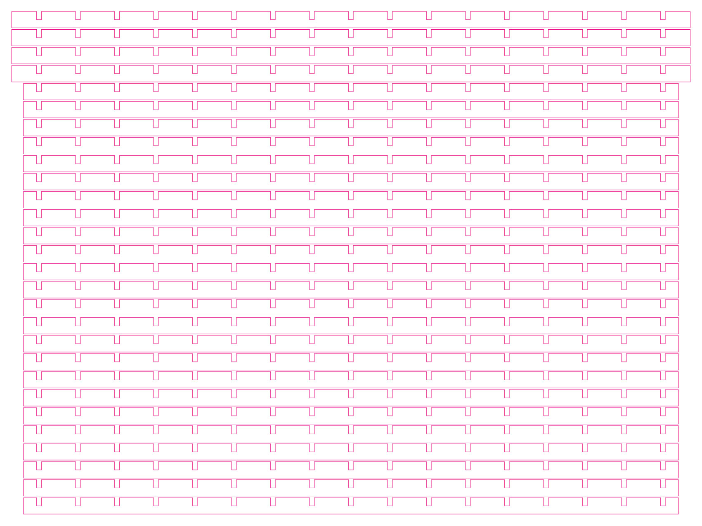
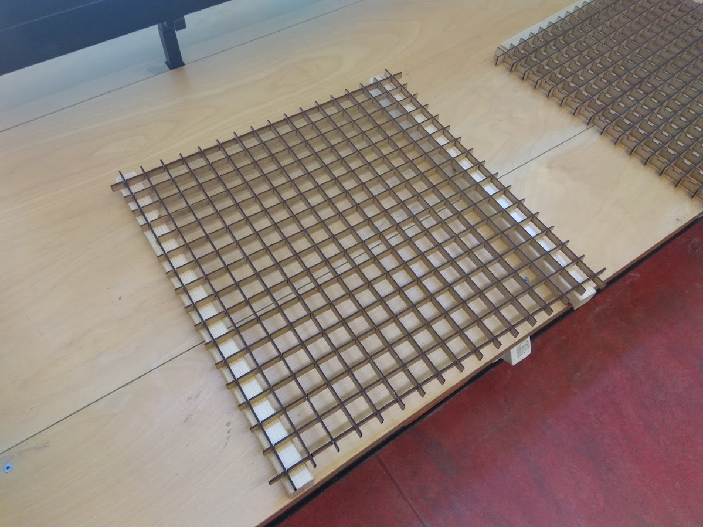

## Matrix
### 1. Lasercutter Zuschnitte anlegen (3 Platten a 60x45cm)
[Illustratordateien](https://github.com/cbm-instructions/bits-please/blob/master/Matrix/Zuschnitt_Matrix.zip)
Dabei darauf achten, dass der Laser stark genug eingestellt ist, sonst können beim Ausbrechen Teile kaputt gehen.

### 2. Die drei Zuschnitte mit einem Lasercutter zuschneiden

### 3. Einzelteile ausbrechen

### 4. Beide Matrizen zusammensetzen und an allen Eckpunkten mit Heißkleber verkleben
Dabei immer die zu verklebende Leiste anheben und in die Aussparungen den Heißkleber geben.
Nicht zu viel Heißkleber verwenden, da man sonst einzeln den Überschuss entfernen muss, da mann dies sonst später sieht.

### 5. Matrizen in den Tisch einsetzen

### 6. Zur idealen Diffusion zwei 55cm Brotpapierbahnen (weiß) zusammenkleben und zwischen die beiden Matrizen legen

