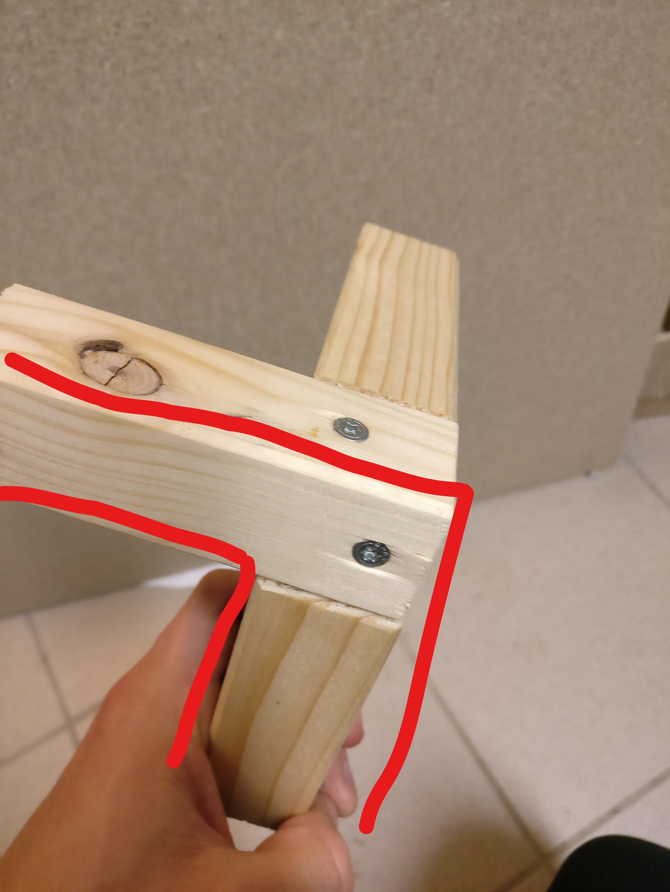
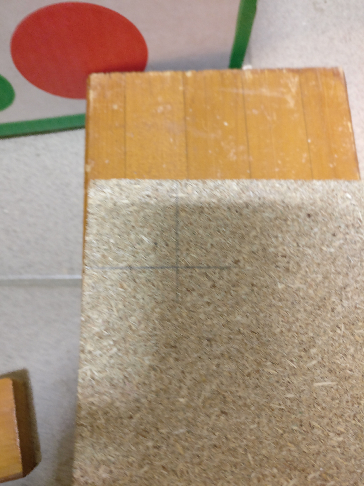

# bits-please | PlayTable

## Einleitung
Der PlayTable ist ein Unterhaltungs/Freizeit Gegenstand und  wurde von dem Team bits-please entwickelt. Es handelt sich hierbei um einen Kleintisch, der eine Matrix aus Pixel besitzt, die aufleuchten können und es können bis zu zwei Leuten mit dem Tisch interagieren. Der PlayTable lässt jedes Gamerherz höher schlagen und dient für den Stressabbau des Hochschul Alltags und den Zusammenschluss von Studierenden und Mitarbeitern.
 
Der PlayTable kann klassische Arcade-Games wie Tetris oder PingPong aufweisen oder einfach nur als Dekoration für den Raum dienen, indem verschiedenste Bilder oder Animationen angezeigt werden.
 
Mit den zwei dazugehörigen Controllern macht das interagieren des Playtable gleich viel mehr Spaß!

### Challenge
Die Welt ist immer im wandel und entwickelt sich immer weiter. So kommen auch neue Begriffe zu stande wie “Smart City”, der in aller Munde ist. Demzufolge soll es Universitäten geben die von denen man behaupten kann sie seien eine “Smart University”. Die Hochschule Mannheim soll natürlich auch mit der Zeit gehen, weswegen uns eine Challange gesetzt wurde.
 
**Wie könnten Menschen in der„Smart HS Mannheim“durch deren intelligente Geräte und Objekte dabei unterstützt werden,angenehmer und spielerischer zu arbeiten?**
 
Weswegen wir uns für die Entwicklung eines “Smart Furniture” entschieden haben, der PlayTable.

### Point of View
Wie können wir den Studierenden helfen den Hochschulaltag entspannter und kreativer zu gestalten. 

## Material und Werkzeug
 
### Material
* Schrumpfschlauch
* Diverse Kabel
 
### Werkzeuge
* Bohrer
* Fräsbohrer 
* Lötkolben
* Heißluftgebläse
* Heißklebepistole
* Schraubendreher Kreuzschlitz 
* Gehrungssäge
* Stichsäge
* Lasercutter
 
### Elektronik
* Arduino mega
* Netzteil (5v, 30A)
* Stromkabel Schuko auf Kaltgerätestecker

### Tisch
* Vierkantholz 34mm x 34mm 
* Spanplatte(65cmx65cm , Stärke 12mm)
* Spaxschrauben
* 

### Matrix
* LED Stripes mit insgesamt 512 LED's auf 16 Stripes a 32 LED's aufgeteilt
* Grid
 
### Controller
* 8x Buttons
* Holz

## Bauanleitung

### Tisch
1. Unebenen Enden des Vierkantholzes absägen

2. Vierkantholz zu je 10 Stücken a 65 cm, mit einem möglichst feinen Sägeblatt, absägen. Achtung!! Erstes Stück als Messlatte für alle anderen Stücke verwenden.

3. Grat an den Sägenenden jeweils mit Schmirgelpapier oder Feile 
entfernen

5. Vier Tischfüsse mithilfe der Bohrschablonevorbohren. Dazu am besten in Schraubstock einspannen, um senkrecht einbohren zu können.
[Bohrschablone](https://github.com/cbm-instructions/bits-please/blob/master/Bilder/Bohrschablone.jpg)

6. Vier Tischfüsse mit restlichen Stücken zu einem Rahmen verschrauben.

7. Aussparung an den Ecken der Bodenplatte mit je 34mm x 34mm mithilfe einer Stichsäge aussägen.  

8. Platte einpassen, eventuell die Ausparungen nachfeilen, und mit je 3 Schrauben pro Seite am Rahmen festschrauben.

### Matrix
...

### Elektronik

### Code
...
