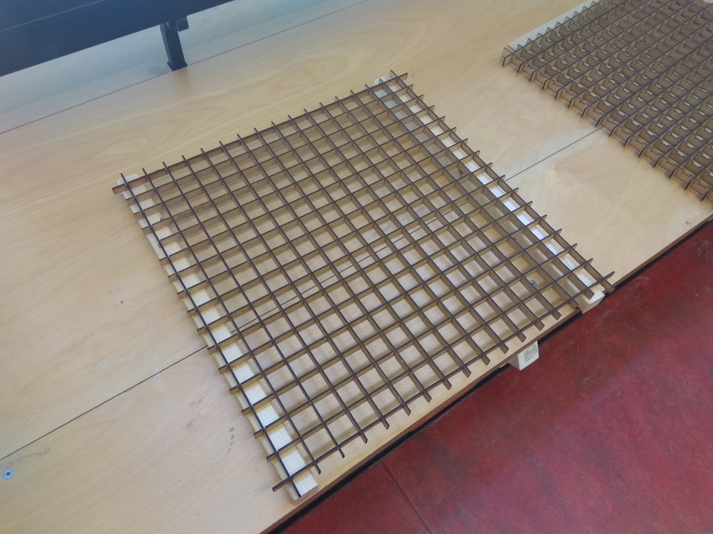
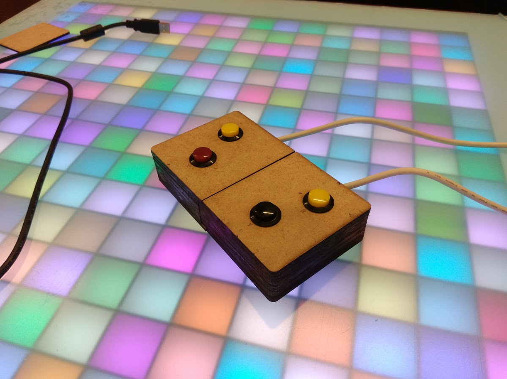
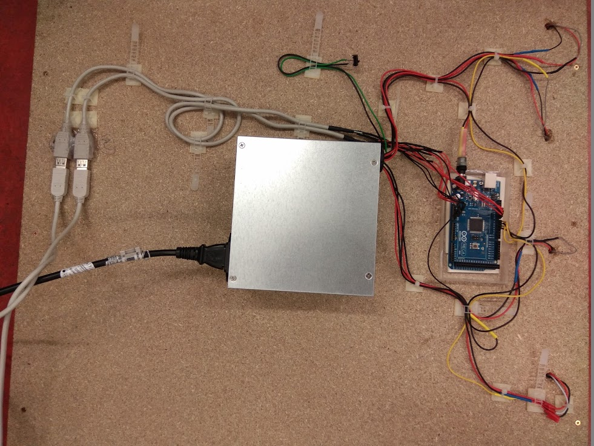
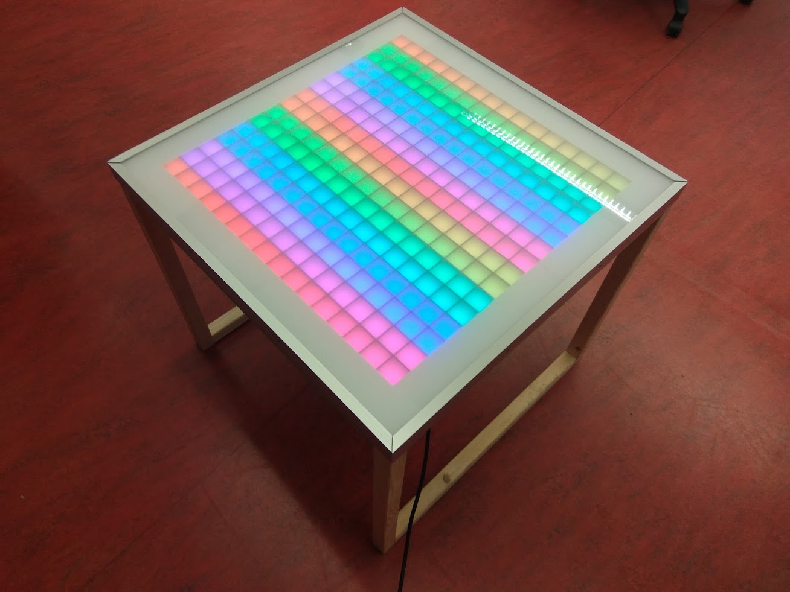

# bits-please | PlayTable

## Einleitung
Der PlayTable ist ein Unterhaltungs-/Freizeitgegenstand und wurde von dem Team bits-please entwickelt. Es handelt sich hierbei um einen kleinen Tisch, in dem eine Matrix aus Pixel integriert ist, welche aufleuchten können. Es können bis zu zwei Leuten mit dem Tisch interagieren. Der PlayTable lässt jedes Gamerherz höher schlagen und dient für den Stressabbau des Hochschulalltags und den Zusammenschluss von Studierenden und Mitarbeitern.
 
Der PlayTable kann klassische Arcade-Games wie Tetris oder Pong aufweisen oder einfach nur als Dekoration für den Raum dienen, indem verschiedenste Bilder oder Animationen angezeigt werden.
 
Mit den zwei dazugehörigen Controllern macht das interagieren des Playtable gleich viel mehr Spaß!

### Challenge
Die Welt ist immer im Wandel und entwickelt sich immer weiter. So kommen auch neue Begriffe zu stande wie “Smart City”, der in aller Munde ist. Demzufolge soll es Universitäten geben, von denen man behaupten kann, dass sie eine “Smart University” sind. Die Hochschule Mannheim soll natürlich auch mit der Zeit gehen, weswegen uns die folgende Challenge gestellt wurde:
 
**Wie könnten Menschen in der „Smart HS Mannheim“ durch deren intelligente Geräte und Objekte dabei unterstützt werden angenehmer und spielerischer zu arbeiten?**
 
Aus diesem Grund haben wir uns für die Entwicklung eines “Smart Furniture” entschieden, nämlich für die Entwicklung des PlayTables.

### Point of View
Wie können wir den Studierenden helfen den Hochschulalltag entspannter und kreativer zu gestalten?

## Material und Werkzeug
 
### Material
* Schrumpfschlauch
* Diverse Kabel
* Kabelbinder
* Lötzinn
* Holzleim (Im Idealfall schnelltrocknend)
 
### Werkzeuge
* Bohrer
* Fräsbohrer 
* Lötkolben
* Abisolierzange
* Heißluftgebläse
* Heißklebepistole
* Schraubendreher Kreuzschlitz 
* Gehrungssäge
* Stichsäge
* Lasercutter
* Seitenschneider
* Schere
* Teppichbodenmesser
 
### Elektronik
* Arduino Mega
* Netzteil 5v,30A z.B. ATX-Netzteil 300W 
* Stromkabel Schuko auf Kaltgerätestecker
* 2x Female USB Kabel
* Schrumpfschlauch diverse Größen
* Lötzinn bleifrei
* Klebesockel
* Kabelbinder
* 4 x Widerstände 1.5K Ohm

### Tisch
* Kantholz (34mm x 34mm) benötogte Länge insgesamt 10 x 65 cm
* Spanplatte(65cm x 65cm , Stärke 12mm)
* Plexiglasplatte (65cm x 65cm,Lichtdurchlässigkeit 79%)
* Spaxschrauben 4mm x 60 mm (Für Rahmen)
* Spaxschrauben 3mm x 30 mm (Für Tischplatte)

### Matrix
* 3x Hochdichte Faserplatte (600mm x 45mm x 3mm)
* LED Stripes (60 LED's / m) zugeschnitten zu 16 Stripes a' 32 LED's 
 
### Controller
* Hochdichte Faserplatte (600mm x 45mm x 3mm)
* 8x 16mm Ø Buttons (Bspw von [Exp-Tech](http://www.exp-tech.de/16mm-panel-mount-momentary-pushbutton-yellow))
* 14 Magneten (5mm x 2,5mm x 2,5mm)
* 2 USB Kabel (2m)

## Bauanleitung

### Tischunterkonstruktion

Bauen des Tischs: [Anleitung](https://github.com/cbm-instructions/bits-please/blob/master/Tisch/README.md)

### Matrix

Anfertigen der Matrix mit dem Lasercutter: [Anleitung](https://github.com/cbm-instructions/bits-please/blob/master/Matrix/README.md)

### Controller

Anfertigen des Controllers: [Anleitung](https://github.com/cbm-instructions/bits-please/blob/master/Controller/README.md)

### Elektronik

Anleitung zur Elektronik: [Anleitung](https://github.com/cbm-instructions/bits-please/blob/master/Elektronik/README.md)

### Finish

Fertigstellen des Tischs: [Anleitung](https://github.com/cbm-instructions/bits-please/blob/master/Finish/README.md)

### Code
Die verwendete .ino Datei gibt's hier: [CBM.ino](https://github.com/cbm-instructions/bits-please/blob/master/Code/CBM.ino) 

Wer nur die Umsetzungen der einzelnen Spiele möchte findet diese hier: 

**Spiele** 
* Pong: [Pong](https://github.com/cbm-instructions/bits-please/blob/master/Code/Pong/Pong.c) 
* Tetris: [Tetris](https://github.com/cbm-instructions/bits-please/blob/master/Code/Tetris/Tetris.c)   
* Snake: [Snake](https://github.com/cbm-instructions/bits-please/blob/master/Code/Snake/Snake.c) 
