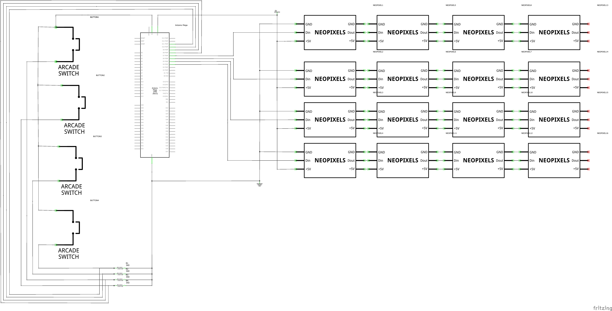
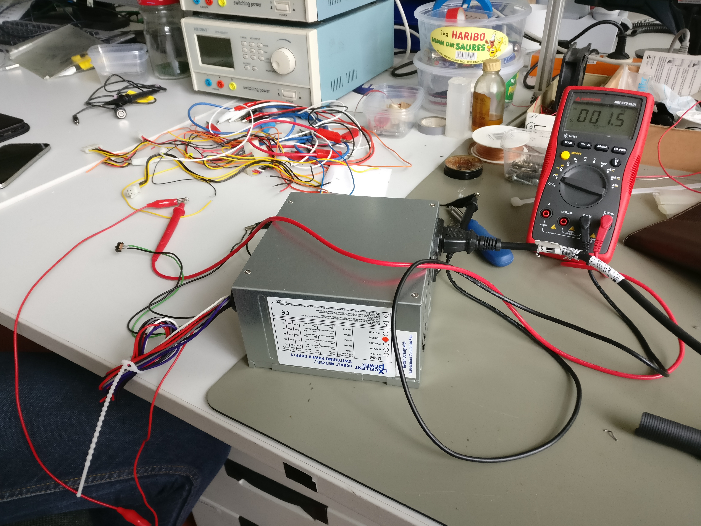
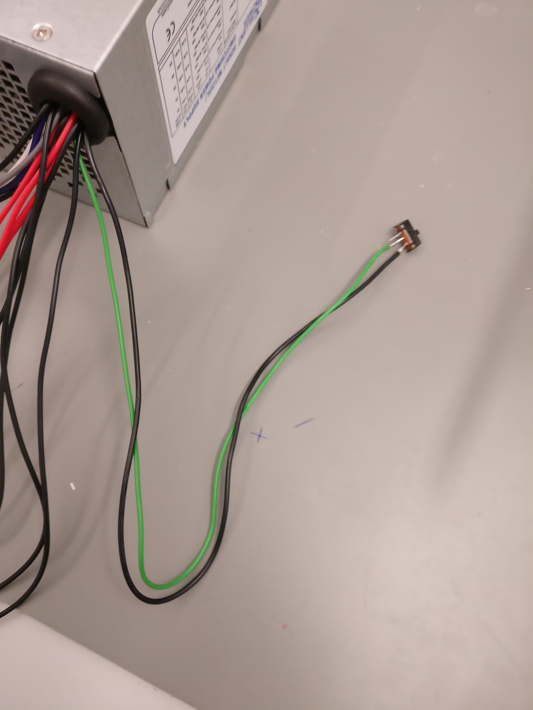
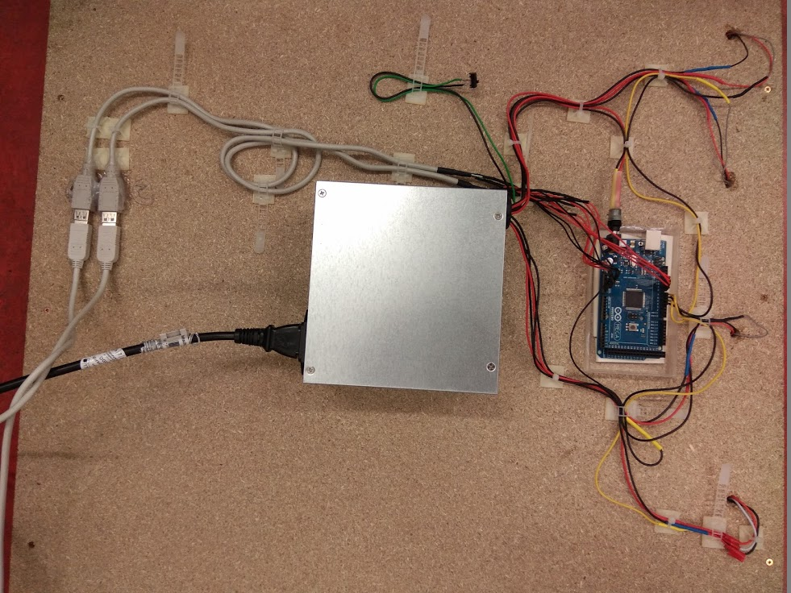

Zum öffnen und bearbeiten des Schaltplans wird das Tool "Fritzing" benötigt. 
http://fritzing.org/download/ 
## Elektronik

### Stromversorgung 

### AdaFruit NeoPixel am Arduino Mega
Auf die Stromversorgung der einzelnen Pixel muss geachtet werden.  
Ein einzelner NeoPixel kann **20mA bis zu 60mA** Strom ziehen, je nach der Einstellung in der Software.

Da wir bei einer 16x16 Pixel Matrix, wobei jeder einzelner Pixel 2 LED NeoPixel besitzt, wird der Strombedarf wie folgt berechnet: 
 
**16 LED Stripes mit jeweils 32 Neopixel, was uns insgesamt auf 512 NeoPixel bringt.** 
**Das heißt der Strombedarf liegt bei: 10240mA - 30720mA ~ 10,24A - 30,72A**

### Schaltplan

Der Schaltplan ist hier zu finden: [Fritzing-File](https://github.com/cbm-instructions/bits-please/blob/master/Schaltplan/Schaltplan.fzz), [Bild](https://github.com/cbm-instructions/bits-please/blob/master/Schaltplan/Schaltplan.png)

Bei der Verwendung eines gewöhnlichen Computer Netzteils, werden die nicht verwendeten Kabel entfernt. 

