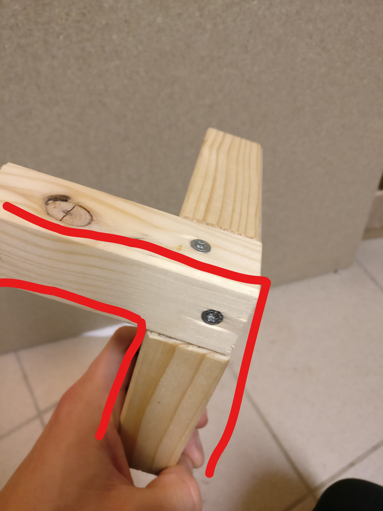
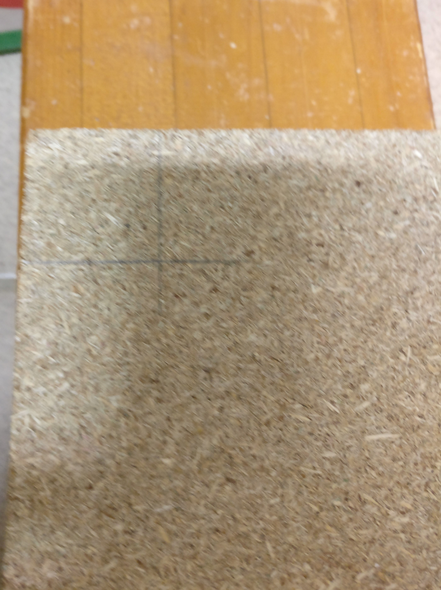

### Tisch
1. Unebenen Enden des Vierkantholzes absägen

2. Vierkantholz zu je 10 Stücken a 65 cm, mit einem möglichst feinen Sägeblatt, absägen. Achtung!! Erstes Stück als Messlatte für alle anderen Stücke verwenden.

3. Grat an den Sägenenden jeweils mit Schmirgelpapier oder Feile 
entfernen

5. Vier Tischfüsse mithilfe der Bohrschablonevorbohren. Dazu am besten in Schraubstock einspannen, um senkrecht einbohren zu können.
[Bohrschablone](https://github.com/cbm-instructions/bits-please/blob/master/Bilder/Bohrschablone.jpg)

6. Vier Tischfüsse mit restlichen Stücken zu einem Rahmen verschrauben.

7. Aussparung an den Ecken der Bodenplatte mit je 34mm x 34mm mithilfe einer Stichsäge aussägen.  

8. Platte einpassen, eventuell die Ausparungen nachfeilen, und mit je 3 Schrauben pro Seite am Rahmen festschrauben.

